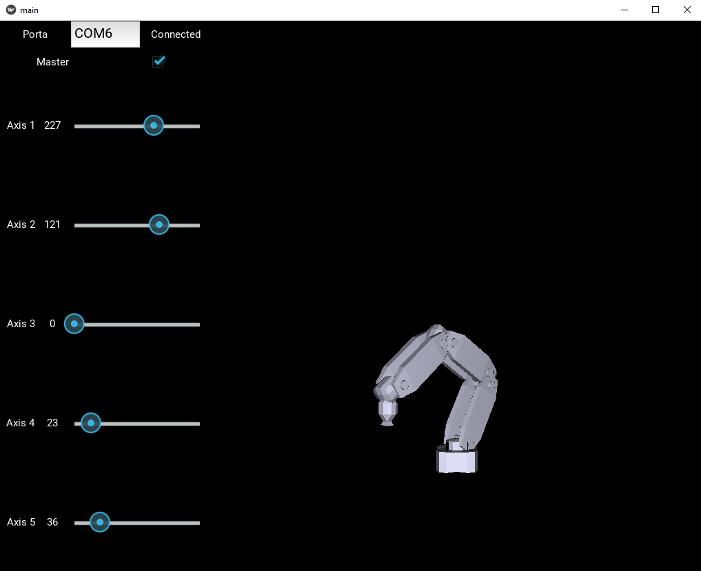

# Robotic-Arm-Controller-Kivy

This project allows you to control a **Robotic Arm** (made with Arduino) via **Serial Connection**.

It can also work in **Slave** mode in which it performs the function of **displaying** the movement of the Robotic Arm in **Real time**.

